Alireza lorzadeh, STAT540 Assignment 1
========================================================

## Q0 (0 pts) Intake

Q:Load the data. Smell test it. Fiddle with factor levels and do any other light cleaning you deem necessary. You can set include = FALSE for some/all of this code, but DO IT.


```r
gDat <- read.table("GSE7191-data.txt", header = TRUE, row.names = 1)
gDesign <- read.table("GSE7191-design.txt", header = TRUE, row.names = 1)
gDesign$Genotype <- factor(gDesign$Genotype, levels = c("Wild_type", "S1P2_KO", 
    "S1P3_KO"))
```


A:Files were loaded, Data file and Design file.
Levels in Genotype factor in Design file were re-arrange to "Wild_type", "S1P2_KO","S1P3_KO"


Next all the neccerirly libraries are loaded:


```r
library(limma)
library(lattice)
library(grid)
library(hexbin)
library(gplots)
```

```
## KernSmooth 2.23 loaded
## Copyright M. P. Wand 1997-2009
## 
## Attaching package: 'gplots'
## 
## The following object is masked from 'package:stats':
## 
##     lowess
```

```r
library(ggplot2)
library(plyr)
library(preprocessCore)
library(RColorBrewer)
library(reshape2)
library(statmod)
library(stats)
```


```r
opts_chunk$set(comment = NA)
```


Q1 (2 points) What are the basic characteristics of the data and meta-data?
============================================================================
## Q1a: How many probes? How many samples?

A:there are 12422 probes and 50 samples

Let see how the data looks like:

```r
## str(gDat)
dim(gDat)
```

```
[1] 12422    50
```


A:there are 12422 probes and 50 samples

Lets see what the data consist of:

```r
head(gDat, n = 5)
```

```
          GSM172927 GSM172928 GSM172929 GSM172930 GSM172931 GSM172932
100001_at     4.279     4.121     4.523     4.224     4.392     4.234
100002_at     6.706     6.780     6.493     6.454     6.678     6.556
100003_at     5.298     5.240     4.929     4.871     5.229     5.011
100004_at     5.938     5.824     5.990     5.915     6.114     5.953
100005_at     6.552     6.605     6.565     6.510     6.586     6.849
          GSM172933 GSM172934 GSM172935 GSM172936 GSM172937 GSM172938
100001_at     4.332     4.301     4.389     4.255     4.314     4.373
100002_at     6.670     6.484     6.615     6.596     6.477     6.603
100003_at     5.130     5.210     5.266     5.228     5.264     5.045
100004_at     6.053     5.906     6.105     5.985     5.838     5.963
100005_at     6.857     6.645     6.784     6.627     6.750     6.741
          GSM172939 GSM172940 GSM172941 GSM172942 GSM172943 GSM172944
100001_at     4.522     4.220     4.314     4.252     4.151     4.365
100002_at     6.574     6.530     6.660     6.977     6.653     6.598
100003_at     5.028     5.215     5.151     5.040     5.225     5.260
100004_at     5.949     5.968     5.978     6.099     6.064     6.125
100005_at     6.734     6.730     6.744     6.863     6.863     6.558
          GSM172945 GSM172946 GSM172947 GSM172948 GSM172949 GSM172950
100001_at     4.312     4.309     4.329     4.294     4.440     4.457
100002_at     6.559     6.572     6.640     6.357     6.642     6.714
100003_at     5.224     5.437     5.152     5.145     4.889     5.112
100004_at     5.891     5.768     5.988     6.065     5.834     5.869
100005_at     6.771     6.872     6.934     6.960     6.588     6.554
          GSM172951 GSM172952 GSM172953 GSM172954 GSM172955 GSM172956
100001_at     4.365     4.228     4.411     4.414     4.308     4.425
100002_at     6.703     6.788     6.573     6.779     6.665     6.639
100003_at     5.238     5.292     5.383     5.513     5.787     5.714
100004_at     5.987     5.701     5.647     5.609     5.705     5.444
100005_at     6.552     6.684     6.628     6.673     6.627     6.763
          GSM172957 GSM172958 GSM172959 GSM172960 GSM172961 GSM172962
100001_at     4.379     4.237     4.317     4.395     4.344     4.341
100002_at     6.841     6.684     6.645     6.687     6.822     6.700
100003_at     5.940     5.995     5.817     5.772     5.611     5.783
100004_at     5.831     5.699     5.830     5.615     5.733     5.673
100005_at     6.827     6.847     6.747     6.786     6.799     6.803
          GSM172963 GSM172964 GSM172965 GSM172966 GSM172967 GSM172968
100001_at     4.256     4.397     4.249     4.270     4.337     4.240
100002_at     6.718     6.714     6.766     6.665     6.844     6.887
100003_at     5.590     5.783     5.614     5.679     5.708     6.085
100004_at     5.713     5.744     5.544     5.659     5.680     5.687
100005_at     6.898     6.806     6.847     6.712     6.891     6.630
          GSM172969 GSM172970 GSM172971 GSM172972 GSM172973 GSM172974
100001_at     4.443     4.009     4.248     4.805     4.147     4.392
100002_at     6.536     6.584     6.708     6.807     6.583     6.726
100003_at     5.779     5.618     5.484     5.725     5.685     5.714
100004_at     5.736     5.498     5.726     5.777     5.845     5.591
100005_at     6.690     6.863     7.061     6.979     6.687     6.695
          GSM172975 GSM172976
100001_at     4.342     4.452
100002_at     6.923     7.160
100003_at     5.834     6.121
100004_at     5.750     5.603
100005_at     6.725     6.414
```


## Q1b: What is the breakdown of samples for Genotype, BrainRegion, Sex, and DateRun?

Q:For starters, cross-tabulate Genotype and BrainRegion. Then do some cross-tabulation involving DateRun and, optionally, Sex to investigate if these "nuisance" factors are confounded with the experimental factors. Make sure you've included counts for all 4 individual factors somewhere, even if it's just in the margins of a cross-tabulation.
How do you feel about the experimental design? Hint: table() and addmargins() will help.

A:Lets take a look at Design data and levels of factors:

```r
summary(gDesign)
```

```
     DateRun       Genotype       BrainRegion     Sex    
 08/14/03:8   Wild_type:20   hippocampus:25   female:26  
 08/21/03:8   S1P2_KO  :20   neocortex  :25   male  :24  
 01/16/04:7   S1P3_KO  :10                               
 09/11/03:7                                              
 10/23/03:7                                              
 12/18/03:5                                              
 (Other) :8                                              
```

```r
dim(gDesign)
```

```
[1] 50  4
```


Cross tabulation:


```r
addmargins(with(gDesign, table(Genotype, BrainRegion)))
```

```
           BrainRegion
Genotype    hippocampus neocortex Sum
  Wild_type          10        10  20
  S1P2_KO            10        10  20
  S1P3_KO             5         5  10
  Sum                25        25  50
```

```r
addmargins(with(gDesign, table(Genotype, Sex)))
```

```
           Sex
Genotype    female male Sum
  Wild_type     10   10  20
  S1P2_KO       10   10  20
  S1P3_KO        6    4  10
  Sum           26   24  50
```

```r
addmargins(with(gDesign, table(Genotype, DateRun)))
```

```
           DateRun
Genotype    01/16/04 03/11/04 07/23/04 08/14/03 08/21/03 09/11/03 10/23/03
  Wild_type        0        0        0        4        8        7        0
  S1P2_KO          0        4        4        4        0        0        7
  S1P3_KO          7        0        0        0        0        0        0
  Sum              7        4        4        8        8        7        7
           DateRun
Genotype    12/18/03 Sum
  Wild_type        1  20
  S1P2_KO          1  20
  S1P3_KO          3  10
  Sum              5  50
```


As we can see, there are different number of samples of wt(10 samples), S1P2(10 samples), S1P3(5 samples). 
This uneveness in samples can be seem among male and female in S1P3 samples.


The number of samples are low. They are not even. Perhaps more samples can give us more confidence regarding differentially expressed genes.

## Q1c: Create a plot showing the gene expression data for one probe.

Q:Use position, panels or facets, and color to convey the Genotype, BrainRegion, and Sex of the samples.

A: Creating exrpession plot for probe # 256


```r
newDat <- gDesign  # assigning Desing data to new variable
probeOfInt <- gDat[256, ]  # choosing probe # 256
probeOfInt <- t(probeOfInt)  # transposing data for probe's expression
newDat$probeOfInt <- probeOfInt  #adding the probe's expression as a column to design data set
names(newDat)[5] <- "gExp"  #hanging the name of the column for probe expression
xyplot(gExp ~ Genotype | BrainRegion, newDat, group = Sex, auto.key = TRUE)  #plotting expression
```

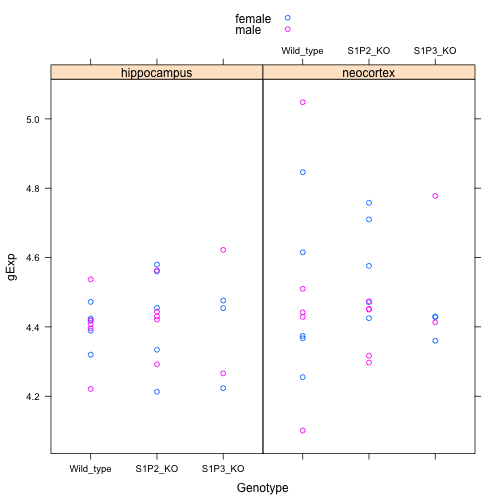 


## Q1d: Report the average expression of the selected probe for all possible combinations of Genotype, BrainRegion and Sex.


```r
meanGexp <- tapply(newDat$gExp, newDat[, c("Sex", "BrainRegion", "Genotype")], 
    mean)  # mean for all 8 possible combination
meanGexp
```

```
, , Genotype = Wild_type

        BrainRegion
Sex      hippocampus neocortex
  female       4.405     4.491
  male         4.396     4.506

, , Genotype = S1P2_KO

        BrainRegion
Sex      hippocampus neocortex
  female       4.428     4.588
  male         4.430     4.398

, , Genotype = S1P3_KO

        BrainRegion
Sex      hippocampus neocortex
  female       4.384     4.406
  male         4.444     4.595
```


Q2 (4 points) Examine the sample correlation matrix.
======================================================

## Q2a: Depict the sample-to-sample correlations in a heatmap.

A:At the very least, order the samples by run date; within run date, you could also sort on other factors. What do you see about batch effects, outliers, etc.? Hint: cor() and heatmap() are helpful.


```r
runDate <- data.frame(newDat$DateRun, newDat$gExp)
names(runDate)[2] <- "gExp"
names(runDate)[1] <- "Date"
runDate$Date <- strptime(runDate$Date, format = "%m/%d/%Y")  #rearranging the date format
format(runDate$Date, format = "%Y-%m-%d")
```

```
 [1] "0003-08-21" "0003-08-21" "0003-08-21" "0003-08-21" "0003-09-11"
 [6] "0003-08-14" "0003-08-14" "0003-09-11" "0003-09-11" "0003-09-11"
[11] "0003-12-18" "0003-10-23" "0003-10-23" "0004-03-11" "0004-03-11"
[16] "0003-08-14" "0003-08-14" "0003-10-23" "0004-07-23" "0004-07-23"
[21] "0004-01-16" "0004-01-16" "0003-12-18" "0003-12-18" "0004-01-16"
[26] "0003-08-21" "0003-08-21" "0003-08-21" "0003-08-21" "0003-12-18"
[31] "0003-08-14" "0003-08-14" "0003-09-11" "0003-09-11" "0003-09-11"
[36] "0003-10-23" "0003-10-23" "0003-10-23" "0004-03-11" "0004-03-11"
[41] "0003-08-14" "0003-08-14" "0003-10-23" "0004-07-23" "0004-07-23"
[46] "0004-01-16" "0004-01-16" "0003-12-18" "0004-01-16" "0004-01-16"
```

```r
# ordering the data set based on run date
gDat_2_order <- order(runDate$Date)
runDate <- runDate[gDat_2_order, ]
gDat_2 <- gDat
gDat_2 <- gDat_2[, gDat_2_order]
cor_gDAt_2 <- cor(gDat_2)
cols <- c(rev(brewer.pal(9, "YlOrRd")), "#FFFFFF")
heatmap.2(cor_gDAt_2, Rowv = NA, Colv = NA, symm = T, trace = "none", dendrogram = "none", 
    col = cols, cexCol = 0.5, cexRow = 0.5, main = "gene expression_RunDate_ordered")
```

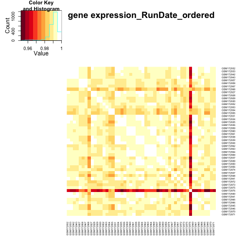 

 

A:The dark bands corresponds to the outlier in the data set. A batch effect will lead to presence of separate section corresponding to the number of different days the experiment was conducted. Here there seems to be no batch effect. (at least not clear enough in the heat map)

## Q2b: Identify the outlier sample.

Q:Try to go beyond merely "eyeballing" it, i.e. make a quantitative statement about how it "sticks out" from the other samples.


```r
mean_gDat_2 <- rowMeans(cor_gDAt_2)  # mean of each row
all_mean_gDat_2 <- mean(mean_gDat_2)  #mean of all expression
Sd_gDat_2 <- sd(cor_gDAt_2)  # standard deviation for whole data
dif_mean_gDat_2 <- (all_mean_gDat_2 - mean_gDat_2)  # difference of prob mean and over all mean
outlier <- dif_mean_gDat_2/Sd_gDat_2  #difference of prob mean and over all mean divided by the sd
plot(outlier, xlab = "expression", ylab = "sd", main = "mean expression level", 
    ylim = c(-5, 5), col = ifelse(outlier >= 3, "red", "black"))
abline(h = 0, col = "red")
```

 


A:Oulier is coloured red. It is ~4 sd differes from the overall mean

## Q2c: Examine the outlier in the context of its experimental group.

Q:Which group is the outlier in, in terms of Genotype, BrainRegion, and Sex? Scatter plot these samples against each other and comment on the plot. Try to address overplotting! Hint: splom() from lattice is helpful.


```r
gDesign_2 <- gDesign  #assigning Design data to a new variable
gDesign_2$DateRun <- strptime(gDesign_2$DateRun, format = "%m/%d/%Y")  # re-arranging date 
format(gDesign_2$DateRun, format = "%Y-%m-%d")
```

```
 [1] "0003-08-21" "0003-08-21" "0003-08-21" "0003-08-21" "0003-09-11"
 [6] "0003-08-14" "0003-08-14" "0003-09-11" "0003-09-11" "0003-09-11"
[11] "0003-12-18" "0003-10-23" "0003-10-23" "0004-03-11" "0004-03-11"
[16] "0003-08-14" "0003-08-14" "0003-10-23" "0004-07-23" "0004-07-23"
[21] "0004-01-16" "0004-01-16" "0003-12-18" "0003-12-18" "0004-01-16"
[26] "0003-08-21" "0003-08-21" "0003-08-21" "0003-08-21" "0003-12-18"
[31] "0003-08-14" "0003-08-14" "0003-09-11" "0003-09-11" "0003-09-11"
[36] "0003-10-23" "0003-10-23" "0003-10-23" "0004-03-11" "0004-03-11"
[41] "0003-08-14" "0003-08-14" "0003-10-23" "0004-07-23" "0004-07-23"
[46] "0004-01-16" "0004-01-16" "0003-12-18" "0004-01-16" "0004-01-16"
```

```r
gDesign_2 <- gDesign_2[order(gDesign_2$DateRun), ]  #ordering base on date
gDesign_2$outlier <- outlier  #add the outlier column (difference of prob mean and over all mean divided by the sd) from previous section to the design data set
subset(gDesign_2, subset = outlier >= 3)  # extracting the outlier, threshold was chosen base on the expressionVSsd from Q2b
```

```
             DateRun Genotype BrainRegion    Sex outlier
GSM172976 0004-01-16  S1P3_KO hippocampus female    3.81
```

```r
outlier_group <- subset(gDesign_2, (Genotype == "S1P3_KO") & (BrainRegion == 
    "hippocampus") & (Sex == "female"))  #exctracting the whle group which the outlier belongs to
outlier_group
```

```
             DateRun Genotype BrainRegion    Sex outlier
GSM172974 0003-12-18  S1P3_KO hippocampus female  0.1646
GSM172975 0004-01-16  S1P3_KO hippocampus female -0.1843
GSM172976 0004-01-16  S1P3_KO hippocampus female  3.8101
```

```r
outlier_group_exp <- data.frame(gDat_2[, "GSM172974"], gDat_2[, "GSM172976"], 
    gDat_2[, "GSM172975"])
colnames(outlier_group_exp) <- c("GSM172974", "GSM172975", "GSM172976")
splom(outlier_group_exp, panel = panel.smoothScatter, raster = TRUE)
```

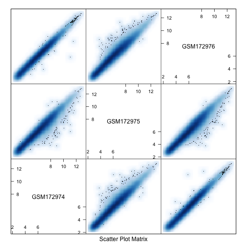 


A:Outlier is GSM172976 S1P3_KO hippocampus female. The oulier does not show good corrolation with other samples in same group. There some data points that are skewed towards the outlier. The other two samples corrolate well with one another. 


Q3 (4 points) Normalization, what it can and can't do.
=======================================================

## Q3a: Make boxplots.

Q:Make a pair of plots: each plot will show gene expression boxplots, one per sample. Identify the outlier sample with a different color, if you can. Comment on these plots, in general and with respect to the outlier.

Here are the 2 plots:

    The data as provided
    The data after you apply quantile normalization.

Hint: normalize.quantiles() in the Bioconductor package preprocessCore is helpful. So are graphics::boxplot(), lattice::bwplot() and ggplot2::geom_boxplot()


```r
cor_gDat_3 <- cor_gDAt_2  #Using correlation data you can identify the outlier, boxplot of correlation data can help identifying outlier. (not shown here) Using box plot a threshold was found to color code the outlier in the box plot below. 
boxplot(gDat_2, outcol = "Brown", col = ifelse(rowMeans(cor_gDat_3) <= 0.97, 
    "red", "Green"), las = 2, main = "Gene expression no normalzation")  # Box plot of gene expression before normalization. the thershold to identify the outlier here is set to 0.97
```

 


A: The oulier is not obvious using this plot. 


```r
# normalization
gDat_3 <- gDat_2  #assigning data set to a new variable
gDat_3_mtx <- as.matrix(gDat_3)  #coverting the data set to matrix format
norm_gDat_3 <- normalize.quantiles(gDat_3_mtx)  #normalizing the data
colnames(norm_gDat_3) <- colnames(gDat_3[])  #transferring column names
boxplot(norm_gDat_3, outcol = "Brown", col = ifelse(rowMeans(cor_gDat_3) <= 
    0.97, "red", "Green"), las = 2, main = "Gene expression quantile normalization")  # box plot of normlaized data
```

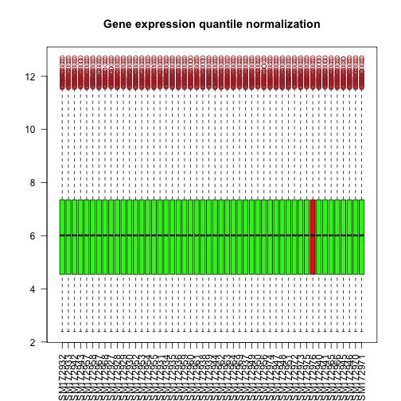 


A: Normalization of the data did not distinguished the outlier. The distribuition of outlier has been normalized with respect to all samples in the data.

## Q3b: Did normalization fix the outlier?

Q: With the quantile-normalized data, re-make the heatmap of the sample correlation matrix and re-compare the outlier to its experimental group. Is everything OK now?


```r
norm_cor_gDat_3 <- cor(norm_gDat_3)  # correlation of the nrmalized the data
cols <- c(rev(brewer.pal(9, "YlOrRd")), "#FFFFFF")  #setting up the color array for the heatmap
heatmap.2(norm_cor_gDat_3, Rowv = NA, Colv = NA, symm = T, trace = "none", dendrogram = "none", 
    col = cols, cexCol = 0.5, cexRow = 0.5, main = "gene expression_normalized")  #heatmap of the normalized data
```

 


A:Heatmap for nromalized data resembles the heatmap for the un-normalized data. The presence of outlier can be crearly detected. 


```r
outlier_group_exp_3 <- data.frame(norm_gDat_3[, "GSM172974"], norm_gDat_3[, 
    "GSM172975"], norm_gDat_3[, "GSM172976"])  #Extracting the outlier and other samples in the same group
colnames(outlier_group_exp_3) <- c("GSM172974", "GSM172975", "GSM172976")  #Changing the columns names to the samples name
splom(outlier_group_exp_3, panel = panel.smoothScatter, raster = TRUE)  #plotting the samples against each other
```

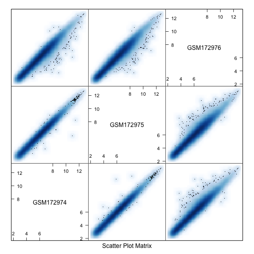 


A:correlation plots among the samples in the oulier's group. The normalization did not change the effect of outlier

## Q3c: Form a dataset that omits the outlier and quantile normalize it.


```r
gDat_noOut_3 <- gDat_2  # assigning the data set to a new variable
gDat_noOut_3$GSM172976 <- NULL  # removing the outlier
gDat_noOut_matx_3 <- as.matrix(gDat_noOut_3)
gDat_noOut_norm_3 <- normalize.quantiles(gDat_noOut_matx_3)  #normalizing
colnames(gDat_noOut_norm_3) <- colnames(gDat_noOut_3[])  #assigning column names
rownames(gDat_noOut_norm_3) <- rownames(gDat_noOut_3[])  #assigning row names
```


## Q3d Re-make the heatmap of the sample correlation matrix, now that the worst outlier is gone. Interpret what you see.


```r
gDat_noOut_cor_3 <- cor(gDat_noOut_norm_3)
cols <- c(rev(brewer.pal(9, "YlOrRd")), "#FFFFFF")
heatmap.2(gDat_noOut_cor_3, Rowv = NA, Colv = NA, symm = T, trace = "none", 
    dendrogram = "none", col = cols, cexCol = 0.5, cexRow = 0.5, main = "gene expression_no outlier")  #heatmap after outlier elimination and normalization
```

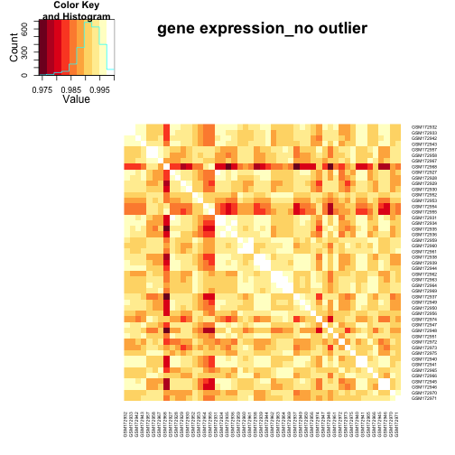 


A: the outlier is not present anymore. This resulted in the other extreme values to be highlighted. However the data is more uniformly ditributed


## Q3e: Remake the expression boxplots for all samples before moving on to differential expression analysis.

Q:How many samples remain?

A: 49 samples remained


```r
boxplot(gDat_noOut_norm_3, outcol = "Brown", las = 2, col = "green", main = "Gene expression with normalzation, no outlier", 
    las = 2)
```

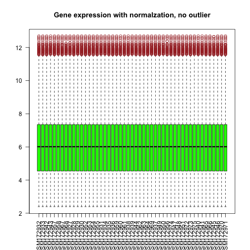 


Q4 (5 points) For each probe, test if it has differential expression across the three genotypes within the neocortex brain region only.
===============================================================================================

Q:You should be using data with the worst outlier removed, after quantile normalization and, for this question, restricted to neocortex.


```r
gDat_4 <- gDat_noOut_norm_3  #assigning normalized data with no outlier to new variable
gDesign_nOut <- gDesign_2[colnames(gDat_4), ]  # eliminating outlier in gDesign
gDat4_neo <- gDat_4[, gDesign_nOut$BrainRegion == "neocortex"]  # restricting to neocortex
## str(gDat4_neo)
```


## Q4a: Write out, in an equation or English or, ideally, both, the model you are fitting.

Q:In the context of that model, what statistical test(s) are you conducting? (You can gloss over the neocortex restriction here.)

A: Y = Xα + ε

Y = θ+τ1+τ2+τ3+ε ;where θ = wild Type, τ1 = S1P2, τ2 = S1P3, τ3 = S1P2 interaction with S1P3 adn ε = error rate
Using linear regression model for differential expression analysis across genotypes

##Q4b: Explore your hits.

Display the expression data for the top 50 probes in a heat map. Order the probes by p-value; order the samples by genotype.


```r
gDesign_neo <- subset(gDesign_nOut, subset = BrainRegion == "neocortex")  #restricting design data set t neo cortex
MM <- model.matrix(~Genotype, gDesign_neo)  #creating model matrix
str(MM)
```

```
 num [1:25, 1:3] 1 1 1 1 1 1 1 1 1 1 ...
 - attr(*, "dimnames")=List of 2
  ..$ : chr [1:25] "GSM172932" "GSM172933" "GSM172942" "GSM172943" ...
  ..$ : chr [1:3] "(Intercept)" "GenotypeS1P2_KO" "GenotypeS1P3_KO"
 - attr(*, "assign")= int [1:3] 0 1 1
 - attr(*, "contrasts")=List of 1
  ..$ Genotype: chr "contr.treatment"
```

```r
neoFit <- lmFit(gDat4_neo, MM)  #fitting a linear model 
## str(neoFit)
summary(neoFit)
```

```
                 Length Class  Mode     
coefficients     37266  -none- numeric  
rank                 1  -none- numeric  
assign               3  -none- numeric  
qr                   5  qr     list     
df.residual      12422  -none- numeric  
sigma            12422  -none- numeric  
cov.coefficients     9  -none- numeric  
stdev.unscaled   37266  -none- numeric  
pivot                3  -none- numeric  
Amean            12422  -none- numeric  
method               1  -none- character
design              75  -none- numeric  
```

```r
neoEbFit <- eBayes(neoFit)
neoTop50 <- topTable(neoEbFit, n = 50, coef = grep("Genotype", colnames(coef(neoEbFit))))  #gettin the top 50 hits
Top50_4_exp <- gDat4_neo[rownames(neoTop50), ]  #assigning row names
heatmap.2(Top50_4_exp[, order(gDesign_neo$Genotype)], scale = "column", Rowv = NA, 
    Colv = NA, symm = T, trace = "none", dendrogram = "none", col = cols, cexCol = 0.5, 
    cexRow = 0.5, main = "Top 50 probes expression")  #heat map and samles are ordered by Genotype
```

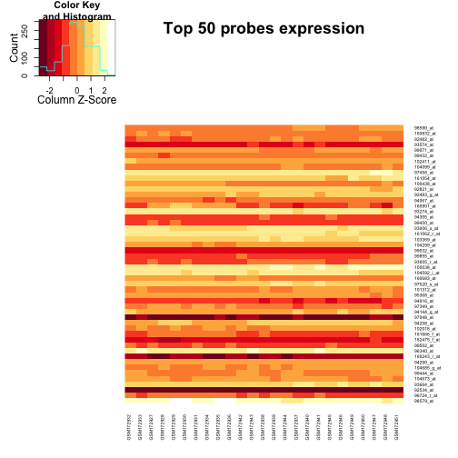 


A: All genes seems to show similar expression across genotypes
## Q4c: Count your hits.

Q: How many probes have unadjusted p-value < 10e-4? 


```r
neoTop_p_4 <- topTable(neoEbFit, n = Inf, coef = grep("Genotype", colnames(coef(neoEbFit))))
above_p <- neoTop_p_4[neoTop_p_4$P.Value < 0.001, ]
cat("There are", nrow(above_p), "probes That have a BH-adjusted p-value, a.k.a. q-value, less than 10e-4.")
```

```
There are 96 probes That have a BH-adjusted p-value, a.k.a. q-value, less than 10e-4.
```


Q:If we took the top 50 probes as our "hits", what is the (estimated) false discovery rate?


```r
neoTop_p_4 <- topTable(neoEbFit, n = 50, coef = grep("Genotype", colnames(coef(neoEbFit))))
neoTop_p_4order <- order(neoTop_p_4$P.Value)
pvalue_order <- neoTop_p_4[neoTop_p_4order, ]
FDR_4 <- neoTop_p_4[50, "adj.P.Val"]
cat("FDR = ", FDR_4)
```

```
FDR =  0.07594
```


Q: How many of these hits do we expect to be false discoveries?


```r
expt_FDR <- neoTop_p_4[50, "adj.P.Val"] * (50)
cat("we expect", expt_FDR, "hits to be false discovery,FDR_4")
```

```
we expect 3.797 hits to be false discovery,FDR_4
```

A: we expect roughly 4 hits to be false discovery
## Q4d: Plot the gene expression data for a few top hits and a few boring probes.

Q: What are the p-values associated with these probes? Comment on the plots.


```r
all_hit <- topTable(neoEbFit, n = Inf, coef = grep("Genotype", colnames(coef(neoEbFit))))  # getting all the hits. 
top_hit <- head(all_hit, n = 5)  # Top five Hits, aka interesting genes
bottom_hit <- tail(all_hit, n = 5)  # bottom five Hits, aka boring genes
```


A: P Values associated with these sets of genes:

```r
summary(top_hit)
```

```
 GenotypeS1P2_KO   GenotypeS1P3_KO     AveExpr           F       
 Min.   :-0.2834   Min.   :-0.240   Min.   :5.17   Min.   :19.3  
 1st Qu.:-0.2662   1st Qu.:-0.145   1st Qu.:6.55   1st Qu.:19.5  
 Median : 0.2690   Median : 0.190   Median :6.69   Median :20.8  
 Mean   : 0.0951   Mean   : 0.204   Mean   :6.47   Mean   :21.3  
 3rd Qu.: 0.2796   3rd Qu.: 0.473   3rd Qu.:6.85   3rd Qu.:21.1  
 Max.   : 0.4765   Max.   : 0.745   Max.   :7.08   Max.   :25.7  
    P.Value           adj.P.Val      
 Min.   :3.09e-07   Min.   :0.00384  
 1st Qu.:1.84e-06   1st Qu.:0.00878  
 Median :2.12e-06   Median :0.00878  
 Mean   :2.39e-06   Mean   :0.00813  
 3rd Qu.:3.70e-06   3rd Qu.:0.00962  
 Max.   :3.96e-06   Max.   :0.00962  
```

```r
summary(bottom_hit)
```

```
 GenotypeS1P2_KO     GenotypeS1P3_KO        AveExpr           F           
 Min.   :-0.002631   Min.   :-1.29e-03   Min.   :5.65   Min.   :0.000071  
 1st Qu.:-0.002346   1st Qu.:-7.47e-04   1st Qu.:6.26   1st Qu.:0.000412  
 Median :-0.000220   Median :-3.92e-04   Median :6.57   Median :0.000434  
 Mean   :-0.000872   Mean   :-1.73e-04   Mean   :6.36   Mean   :0.000393  
 3rd Qu.: 0.000229   3rd Qu.:-8.06e-05   3rd Qu.:6.65   3rd Qu.:0.000511  
 Max.   : 0.000606   Max.   : 1.64e-03   Max.   :6.69   Max.   :0.000536  
    P.Value    adj.P.Val
 Min.   :1   Min.   :1  
 1st Qu.:1   1st Qu.:1  
 Median :1   Median :1  
 Mean   :1   Mean   :1  
 3rd Qu.:1   3rd Qu.:1  
 Max.   :1   Max.   :1  
```


A: First lets look at exciting ones
Exciting genes:

```r
# Top hits
top_hit <- gDat4_neo[rownames(top_hit), ]
top_hit <- melt(t(top_hit), value.name = "gExp")
gDesign_neo_2 <- gDesign_neo
top_hit$Genotype <- gDesign_neo_2[top_hit$Var1, "Genotype"]
ggplot(top_hit, aes(Genotype, gExp, colour = Genotype, group = Var2)) + geom_point() + 
    facet_wrap(~Var2) + stat_summary(fun.y = mean, geom = "line")
```

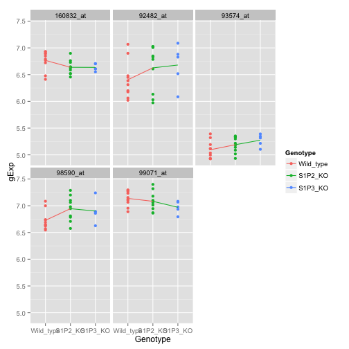 

A: Genes seem to be expressed similarly for each genotype. The mean expression differes across genotype. However in some cases gene expression are very close to one another. Most plots are not a flat line and have an slope.


A: now lets look at the broing genes
bottom hits (boring genes):


```r
bottom_hit <- gDat4_neo[rownames(bottom_hit), ]
bottom_hit <- melt(t(bottom_hit), value.name = "gExp")
gDesign_neo_3 <- gDesign_neo
bottom_hit$Genotype <- gDesign_neo_3[top_hit$Var1, "Genotype"]
ggplot(bottom_hit, aes(Genotype, gExp, colour = Genotype, group = Var2)) + geom_point() + 
    facet_wrap(~Var2) + stat_summary(fun.y = mean, geom = "line")
```

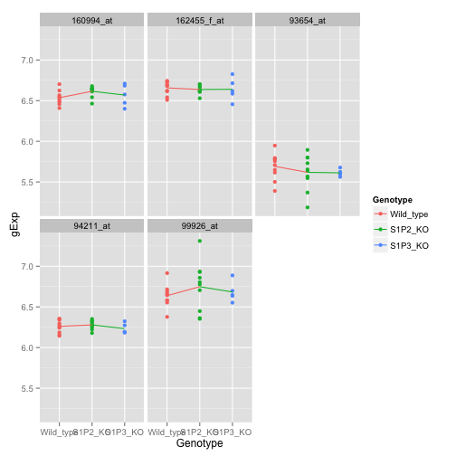 


A: Genes are expressed similarly. Means are same across genotype. plot is a Flat line. They are similar to the exciting gene. Seems genotype does not matter much.  


## Q4e: Find probes where the expression in the S1P3 knockout is different from that of wild type.

Q: How many hits do you find if you control FDR at 0.10?


```r
S1P3_KO <- topTable(neoEbFit, coef = 3, p.value = 0.1, n = Inf)  #S1P3 knock out expression
cat(nrow(S1P3_KO), "hits")  #number f hits
```

```
61 hits
```


Q5 (5 points) Differential expression analysis for Genotype * BrainRegion.
===========================================================================

You should be using data with the worst outlier removed, after quantile normalization and for both brain regions.


```r
gDat5 <- gDat_noOut_norm_3  # assigning the data set with no outlier and normalaized
gDat5_br <- gDat5  # Assiging into a new variable
gDesign5 <- gDesign_nOut  #assiging the design data set with no outlier
```


## Q5a: Fit a 3x2 full factorial model.

Q:Test for any effect of Genotype and/or BrainRegion, i.e. test your model against a model with just an intercept. How many probes have a BH-adjusted p-value, a.k.a. q-value, less than 10e-4?

A: First lets creat a model matrix for both brain regions. then we'll fit a model.

```r
MM5 <- model.matrix(~Genotype * BrainRegion, gDesign5)  #model matrix for both Brain regions
str(MM5)
```

```
 num [1:49, 1:6] 1 1 1 1 1 1 1 1 1 1 ...
 - attr(*, "dimnames")=List of 2
  ..$ : chr [1:49] "GSM172932" "GSM172933" "GSM172942" "GSM172943" ...
  ..$ : chr [1:6] "(Intercept)" "GenotypeS1P2_KO" "GenotypeS1P3_KO" "BrainRegionneocortex" ...
 - attr(*, "assign")= int [1:6] 0 1 1 2 3 3
 - attr(*, "contrasts")=List of 2
  ..$ Genotype   : chr "contr.treatment"
  ..$ BrainRegion: chr "contr.treatment"
```

```r
neoFit5 <- lmFit(gDat5, MM5)  #fitting the model
summary(neoFit5)
```

```
                 Length Class  Mode     
coefficients     74532  -none- numeric  
rank                 1  -none- numeric  
assign               6  -none- numeric  
qr                   5  qr     list     
df.residual      12422  -none- numeric  
sigma            12422  -none- numeric  
cov.coefficients    36  -none- numeric  
stdev.unscaled   74532  -none- numeric  
pivot                6  -none- numeric  
Amean            12422  -none- numeric  
method               1  -none- character
design             294  -none- numeric  
```

```r
neoEbFit5 <- eBayes(neoFit5)
ttable5a <- topTable(neoEbFit5, coef = 2:6, p.value = 0.001, n = Inf)  #hits with q-value < 10^4
cat("There are", nrow(ttable5a), "probes That have a BH-adjusted p-value, a.k.a. q-value, less than 10e-4.")
```

```
There are 1524 probes That have a BH-adjusted p-value, a.k.a. q-value, less than 10e-4.
```


## Q5b: Test the null hypothesis that BrainRegion doesn't matter, i.e. that all terms involving BrainRegion are zero.

Q: How many probes have a BH-adjusted p-value less than 0.1?


```r
ttable5b <- topTable(neoEbFit5, p.value = 0.1, coef = grep("BrainRegion", colnames(coef(neoEbFit5))), 
    n = Inf)
cat("There are", nrow(ttable5b), "probes that have a BH-adjusted p-value less than 0.1.")
```

```
There are 3227 probes that have a BH-adjusted p-value less than 0.1.
```


## Q5c: Highlight some probes where BrainRegion does and does not matter.

Q: Using the results from Q5b, plot and describe some results for a couple of hits and non-hits.


```r
ttable5c <- topTable(neoEbFit5, coef = grep("BrainRegion", colnames(coef(neoEbFit5))), 
    n = Inf)  #all the hits
topHit_5c <- head(ttable5b, n = 6)  #top hits aka exciting
lowHit_5c <- tail(ttable5c, n = 6)  #bottom hits aka boring
```


A: lets look at the top hits first:


```r
summary(topHit_5c)
```

```
 BrainRegionneocortex GenotypeS1P2_KO.BrainRegionneocortex
 Min.   :-1.893       Min.   :-0.3157                     
 1st Qu.:-1.635       1st Qu.:-0.0562                     
 Median :-1.304       Median : 0.0362                     
 Mean   :-0.530       Mean   :-0.0136                     
 3rd Qu.: 0.678       3rd Qu.: 0.0982                     
 Max.   : 1.727       Max.   : 0.1299                     
 GenotypeS1P3_KO.BrainRegionneocortex    AveExpr            F      
 Min.   :-0.21301                     Min.   : 3.36   Min.   :513  
 1st Qu.:-0.13366                     1st Qu.: 5.03   1st Qu.:602  
 Median : 0.00871                     Median : 6.07   Median :615  
 Mean   :-0.04193                     Mean   : 6.53   Mean   :613  
 3rd Qu.: 0.02273                     3rd Qu.: 7.82   3rd Qu.:641  
 Max.   : 0.09771                     Max.   :10.57   Max.   :687  
    P.Value           adj.P.Val       
 Min.   :2.60e-40   Min.   :3.20e-36  
 1st Qu.:1.54e-39   1st Qu.:8.10e-36  
 Median :3.97e-39   Median :1.38e-35  
 Mean   :5.10e-38   Mean   :9.80e-35  
 3rd Qu.:6.30e-39   3rd Qu.:1.64e-35  
 Max.   :2.90e-37   Max.   :5.34e-34  
```

```r

# Top hit aka exciting ones
topHit_5c <- gDat5_br[rownames(topHit_5c), ]  #selecting  top hits from gene expression data set
topHit_5c <- melt(t(topHit_5c), value.name = "gExp")  #fromatting the top hit data set
gDesign5c <- gDesign5  #assigning data design to a new variable
topHit_5c$Genotype <- gDesign5c[topHit_5c$Var1, "Genotype"]  # adding the genotypes
topHit_5c$BrainRegion <- gDesign5c[topHit_5c$Var1, "BrainRegion"]  #adding the brain regions
ggplot(topHit_5c, aes(x = Genotype, y = gExp, color = BrainRegion, group = BrainRegion)) + 
    geom_point() + geom_line(stat = "summary", fun.y = mean) + facet_wrap(~Var2)
```

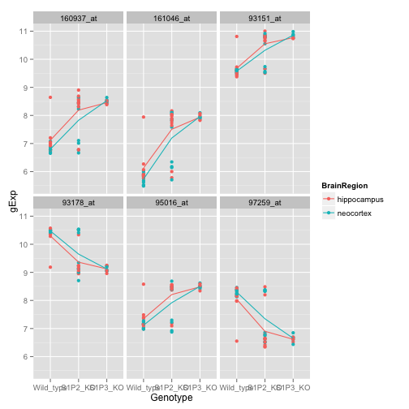 


A:The top hits show very clearly that the expression between the brain regions is not the same for these genes. The line has a slope vs being flat, depicting difference in expression


A: lets look at the boring ones now:

```r
summary(lowHit_5c)
```

```
 BrainRegionneocortex GenotypeS1P2_KO.BrainRegionneocortex
 Min.   :-0.00750     Min.   :-0.001841                   
 1st Qu.:-0.00163     1st Qu.:-0.001587                   
 Median : 0.00267     Median :-0.000936                   
 Mean   : 0.00071     Mean   : 0.001279                   
 3rd Qu.: 0.00342     3rd Qu.: 0.003758                   
 Max.   : 0.00582     Max.   : 0.007868                   
 GenotypeS1P3_KO.BrainRegionneocortex    AveExpr           F          
 Min.   :-0.010176                    Min.   :4.63   Min.   :0.00151  
 1st Qu.:-0.003486                    1st Qu.:5.00   1st Qu.:0.00394  
 Median : 0.001271                    Median :5.19   Median :0.00554  
 Mean   : 0.000872                    Mean   :5.75   Mean   :0.00482  
 3rd Qu.: 0.003871                    3rd Qu.:6.06   3rd Qu.:0.00620  
 Max.   : 0.013202                    Max.   :8.22   Max.   :0.00650  
    P.Value        adj.P.Val
 Min.   :0.999   Min.   :1  
 1st Qu.:0.999   1st Qu.:1  
 Median :0.999   Median :1  
 Mean   :1.000   Mean   :1  
 3rd Qu.:1.000   3rd Qu.:1  
 Max.   :1.000   Max.   :1  
```

```r

# Low hit aka boring ones
lowHit_5c <- gDat5_br[rownames(lowHit_5c), ]
lowHit_5c <- melt(t(lowHit_5c), value.name = "gExp")
gDesign5c_2 <- gDesign5
lowHit_5c$Genotype <- gDesign5c_2[lowHit_5c$Var1, "Genotype"]
lowHit_5c$BrainRegion <- gDesign5c_2[lowHit_5c$Var1, "BrainRegion"]
ggplot(lowHit_5c, aes(x = Genotype, y = gExp, color = BrainRegion, group = BrainRegion)) + 
    geom_point() + geom_line(stat = "summary", fun.y = mean) + facet_wrap(~Var2)
```

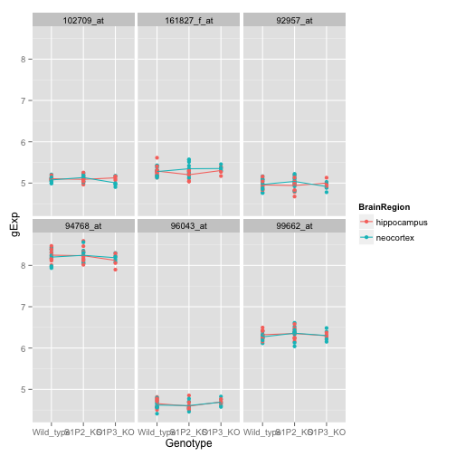 


A: For boring genes, the plot shows a flat line, depicting the same expression across these genes at different regions of brain. The line is flat vs being steep.


## Q5d: Test the null hypothesis that Genotype doesn't matter, i.e. that all terms involving Genotype are zero.


Q:How many probes have a BH-adjusted p-value less than 0.1? 


```r
ttable5d <- topTable(neoEbFit5, coef = grep("Genotype", colnames(coef(neoEbFit5))), 
    n = Inf)
ttable5d_2 <- topTable(neoEbFit5, p.value = 0.1, coef = grep("Genotype", colnames(coef(neoEbFit5))), 
    n = Inf)
cat("There are", nrow(ttable5d_2), "probes that have a BH-adjusted p-value less than 0.1.")
```

```
There are 141 probes that have a BH-adjusted p-value less than 0.1.
```


Q:Compare these results to those obtained for BrainRegion in Q5b, either based on this count or based on all the p-values. What do you conclude about the relative magnitude of the influence of brain region vs. genotype on gene expression?


```r
densityplot(~ttable5d$P.Value, xlab = "p-values", main = "P.value for terms involving gentypes", 
    plot.points = F, auto.key = list(x = 0.95, y = 0.95, corner = c(1, 1)), 
    scales = list(tck = c(1, 0)))
```

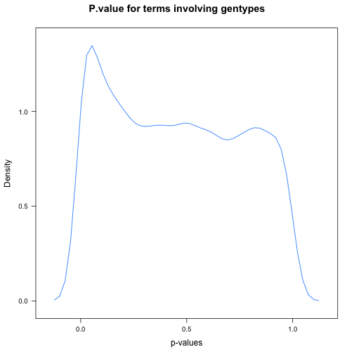 

```r
cat("The average p-value for terms involving genotypes is:", mean(ttable5d$P.Value))
```

```
The average p-value for terms involving genotypes is: 0.4536
```

```r

densityplot(~ttable5b$P.Value, xlab = "p-values", main = "P.value for terms involving brain region", 
    col = "red", plot.points = F, auto.key = list(x = 0.95, y = 0.95, corner = c(1, 
        1)), scales = list(tck = c(1, 0)))
```

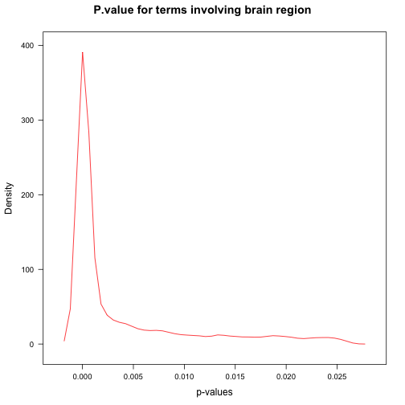 

```r

cat("The average p-value for terms involving brainregion is:", mean(ttable5b$P.Value))
```

```
The average p-value for terms involving brainregion is: 0.003753
```


A:Given that there is more hit for BrainRegion vs Genotype,it seems that majority of the genes are expressed similarly in the diffeerent genotypes when compare to gene expression across brain regions. Brain region has a greater effect on gene expression in magnitude than genotype does. This is clearly depicted in gene expression plots, p. value plots and even the heat map.


